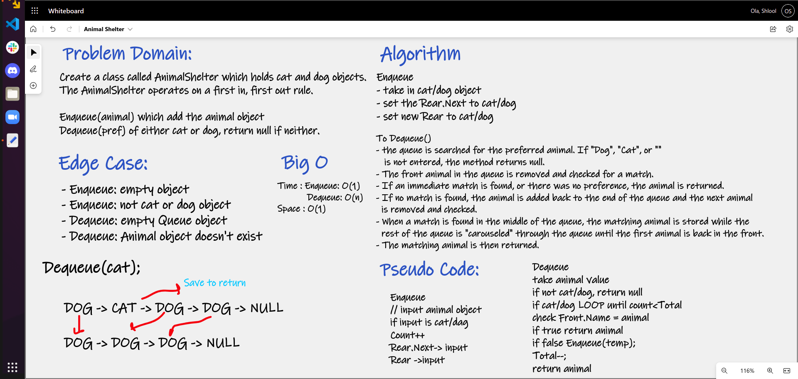

# Animal Shelter

# Challenge Summary
Create a first-in, first-out animal shelter for dogs and cats

Create a class called AnimalShelter which holds only dogs and cats. 
The shelter operates using a first-in, first-out approach. 
Implement the following methods:
- Enqueue(animal): adds animal to the shelter. The animal can be either a dog or a cat object. 
- Dequeue(pref): Returns either a dog or a cat. If pref is not "dog" or "cat" then return null.

## Whiteboard Process

## Approach & Efficiency
AnimalShelter is a queue that follows FIFO principles with an enqueue method that 
does not have any different logic than normal, but dequeue will take in a pref of 
the user of dog or cat and remove the first instance of that type.

Big O Time : Enqueue: O(1) Dequeue: O(n)

Space : O(1)
