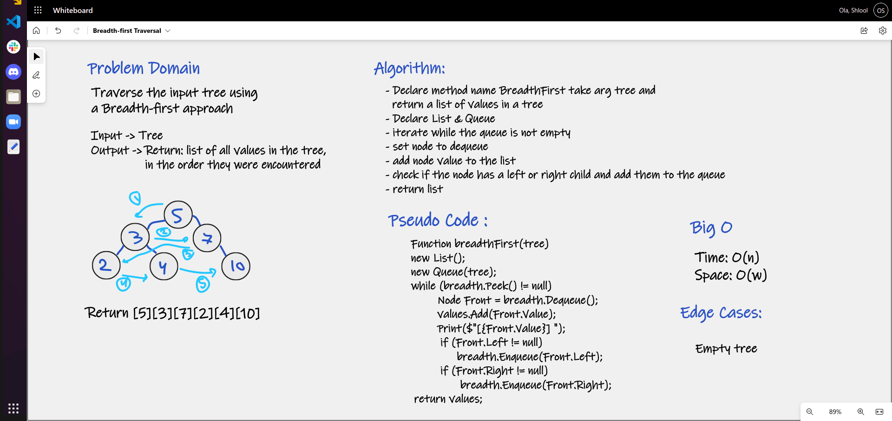

# Breadth First Traversal

# Challenge Summary

Write a function called breadth first, that take arguments: tree and return: 
list of all values in the tree, in the order they were encountered

## Whiteboard Process

## Approach & Efficiency
The Root of the tree is enqueued into a queue. 
Upon dequeue, the left and right children (if they exist) are enqueued. 
Each value is outputted, and if children exist they are enqueued. 
This process continues until all leaves have been reached.

- Time: O(n) since it traverses through each node
- Space: O(w) since a depends on the width of the tree at any given level