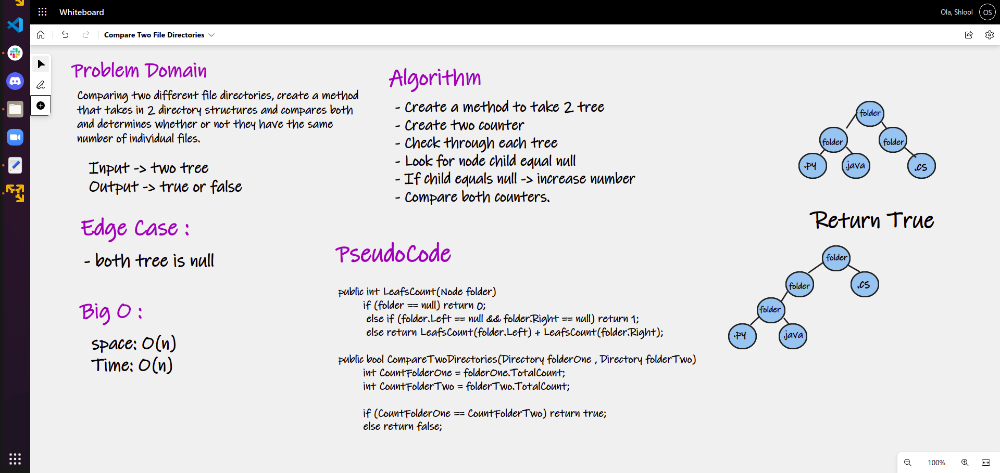

# Compare Two File Directories

## Challenge Summary

The challenge was to create a Method that would accept two trees that contain folders/files (directories) 
and count the number of individual files for both trees. 
If the same number of files on both trees, return true. Else, return false.

## Whiteboard Process

## Approach & Efficiency

- The Big O of time: O(n)

- The Big O of space: O(n)
