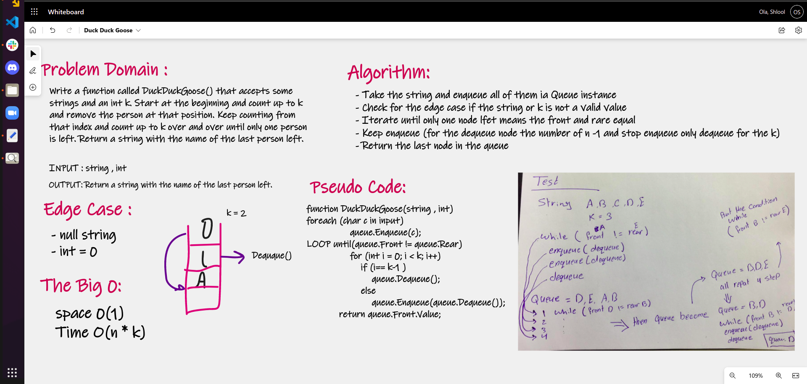

# Duck Duck Goose

# Challenge Summary

write a function called duckduckgoose() that accepts some strings and an int k. 
start at the beginning and count up to k and remove the person at that position. 
keep counting from that index and count up to k over and over until only one person is left. return a string with the name of the last person left.

## Whiteboard Process

## Approach & Efficiency

space 0(1)

Time O(n * k)
