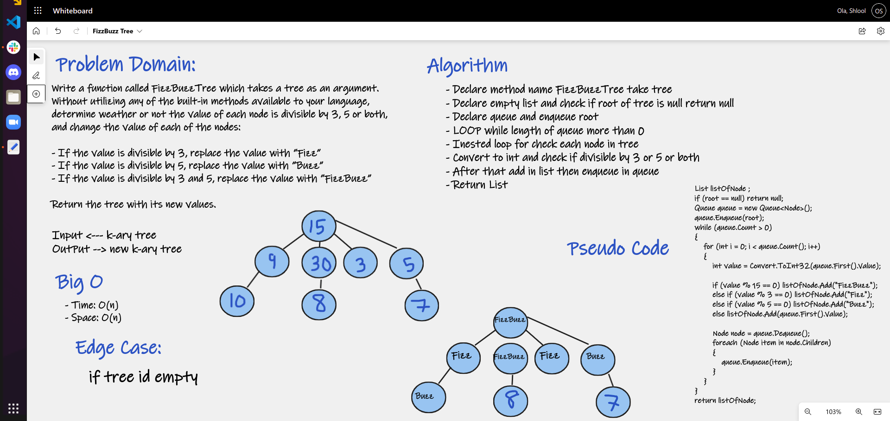

# FizzBuzz Tree

Conduct “FizzBuzz” on a k-ary tree while traversing through it to create a new tree.

# Challenge Summary

Write a function called FizzBuzzTree which takes a tree as an argument. 
Without utilizing any of the built-in methods available to your language, 
determine weather or not the value of each node is divisible by 3, 5 or both, 
and change the value of each of the nodes:

- If the value is divisible by 3, replace the value with “Fizz”
- If the value is divisible by 5, replace the value with “Buzz”
- If the value is divisible by 3 and 5, replace the value with “FizzBuzz”

Return the tree with its new values.

## Whiteboard Process

## Approach & Efficiency
Time: O(n) since it traverses through each node.

Space: O(n) since a new Queue was created to store.