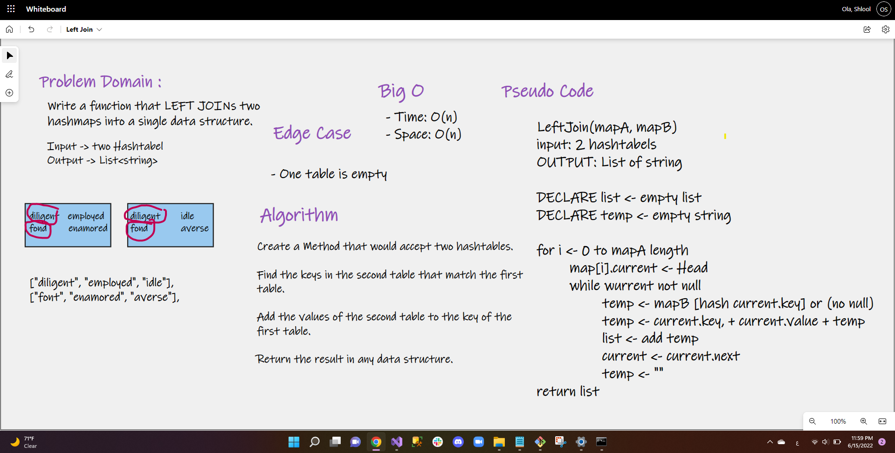

# Lef Join

# Challenge Summary
This will take in two hashmaps and for every value in the left table create an output that is that key, the value in 
the left table, and the value in the right table if it exists.

## Whiteboard Process

## Approach & Efficiency
Created a method that takes in a Hashtable1(synonym) and Hashtable2(antonym) hashtable. The method then goes 
through the Hashtable1  looking for keys. When a key is found, the word and its Hashtable1 are added to a string. 
The method then checks if the key exists in the Hashtable2. If it does, the Hashtable2 is appended to the string. 
This string is then added to a list. When the end of the hashtable is reached, the list is returned by the method.

### Big O
- Time: O(n) 
- Space: O(n)

