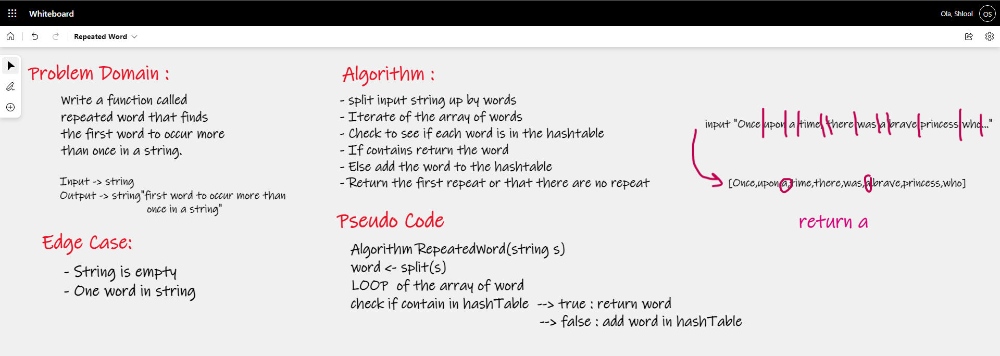

# Repeated Word

# Challenge Summary
The challenge was to create a Method that would accept a string of any number or words. Find the first word that is repeated twice and return that word. 
Return "no repeated" if no repeats are found.

## Whiteboard Process

## Approach & Efficiency
a method was written that takes a string as input. The string is then broken into an array of words.
This array is iterated through, and a hashtable is checked to see if it already contains that word. 
The first time a collision occurs, the current word is returned as the first repeated word. 
If no collisions occur, there are no repeats and "no repeated" is returned by the method.

### Big O
- Time: O(n) 
- Space: O(n)

