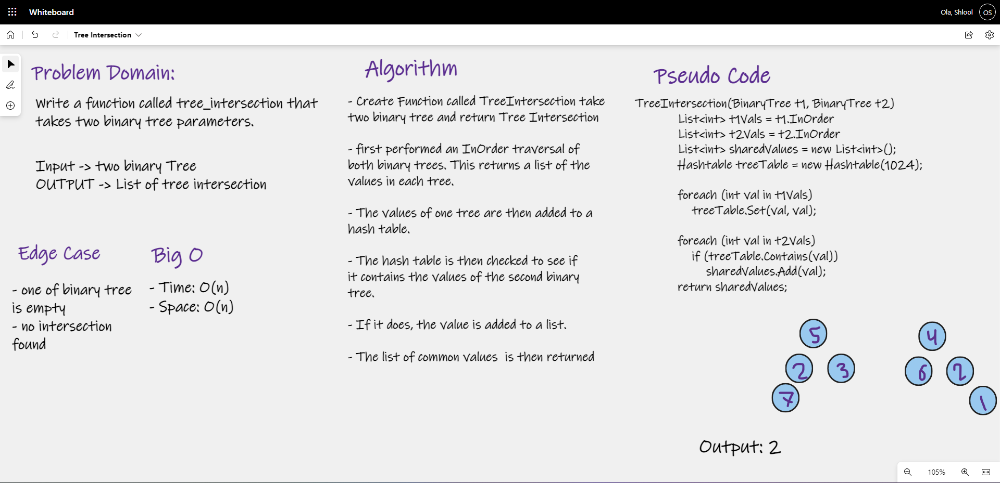

# Tree Intersection

# Challenge Summary
Write a function called tree_intersection that takes two binary tree parameters.

## Whiteboard Process

## Approach & Efficiency

To approach this challenge, I first performed an InOrder traversal of both binary trees. This returns a list of the 
values in each tree. The values of one tree are then added to a hash table. The hash table is then checked to see if 
it contains the values of the second binary tree. If it does, the value is added to a list. The list of common values 
is then returned.

### Big O
- Time: O(n) 
- Space: O(n)

