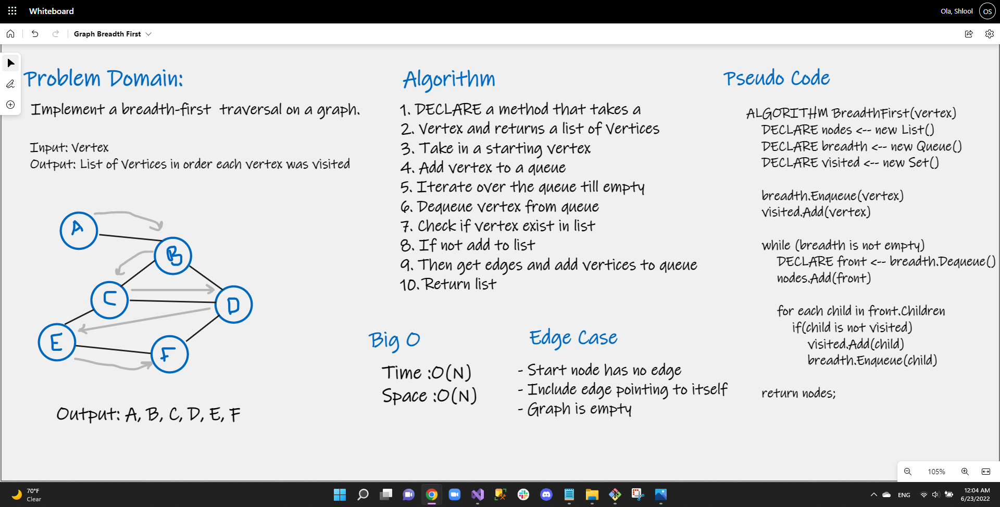
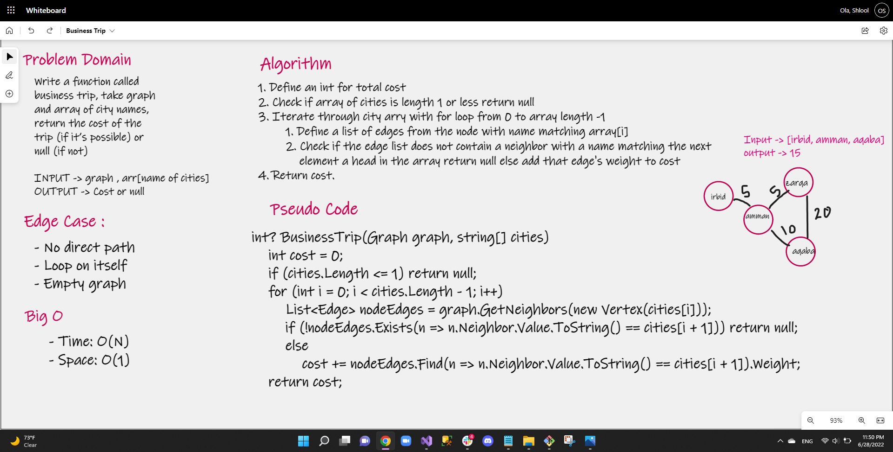

# Graphs
A graph is a non-linear data structure that can be viewed as a collection of vertices (or nodes) potentially connected by line segments named edges. This app demonstrates how a graph and its nodes are created, as well as how nodes are linked together.

## Challenge
Implement your own Graph. The graph should be represented as an adjacency list, and should include the following methods:

AddNode()
* Adds a new node to the graph
* Takes in the value of that node
* Returns the added node

AddEdge()
* Adds a new edge between two nodes in the graph
* Include the ability to have a “weight”
* Takes in the two nodes to be connected by the edge
* Both nodes should already be in the Graph

GetNodes()
* Returns all of the nodes in the graph as a collection (set, list, or similar)

GetNeighbors()
* Returns a collection of nodes connected to the given node
* Takes in a given node
* Include the weight of the connection in the returned collection

Size()
* Returns the total number of nodes in the graph
## Approach & Efficiency
* Big O Space = O(n)
* Big O Time = O(n)

This approach starts with creating a Node class specific to graphs in that each node has properties for a Value, and a List of Edges, and each Edge has properties for a Neighbor node and a Weight of the connection between nodes. Every instance of a graph has its nodes stored in a List of nodes which can be counted or returned as a list.

## API
AddNode()
* Adds a node to the graph.

AddEdge()
* Adds an edge to a node which connects to another node or itself, and includes a weight value.

GetNodes()
* Returns a list of nodes within the graph.

GetNeighbors()
* Returns a list of neighbors of a given node, including the weight of each edge between them.

Size()
* Returns a count of all the nodes in a graph.

# Breadth-First Traversal of a Graph

Breadth First Search (BFS) algorithm traverses a graph in a breadthward motion and uses a queue to remember to get the next 
vertex to start a search, when a dead end occurs in any iteration.

## Challenge

Extend your graph object with a breadth-first traversal method that accepts a starting node. 
Without utilizing any of the built-in methods available to your language, return a collection of nodes in the order 
they were visited. Display the collection.

## Approach & Efficiency
- Time :O(N)
- Space :O(N)
## Solution

# Business Trip (Find Edges)
Taking in a graph of city nodes and a string array of city names, this app will determine if a 
direct path can be found between all nodes in the sequence of the array, and if so, it will also determine 
the sum of the cost between each node.
## Challenge
Write a function called business trip, take graph and array of city names, return the cost of the trip (if it’s possible) or null (if not)
## Approach & Efficiency
- Time :O(N)
- Space :O(1)
## Solution

