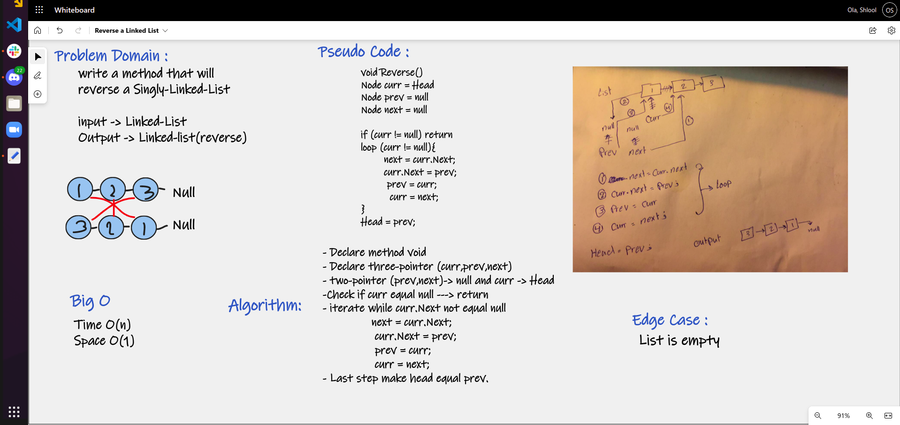

# Reverse Linked List 

## Description

Write a method called Reverse() that reverse a singly linked list.

## Whiteboard Process

## Approach & Efficiency
#### Reverse
- Big O Time = O(n) 
- Big O Space = O(1)

The iterative approach to reversing the array remains linear because constants are not taken 
into consideration. Space remains O(1) since no new data structures are created.

