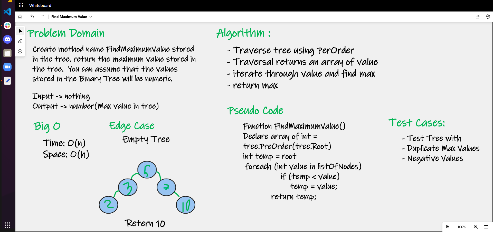

# Find Max Value in Trees

# Challenge Summary

Create method name FindMaximumValue stored in the tree. 
return the maximum value stored in the tree. You can assume that the values stored in the Binary Tree will be numeric.

## Whiteboard Process

## Approach & Efficiency

- Time: O(n) since it traverses through each node
- Space: O(h) since a depends on the height of the tree at any given level