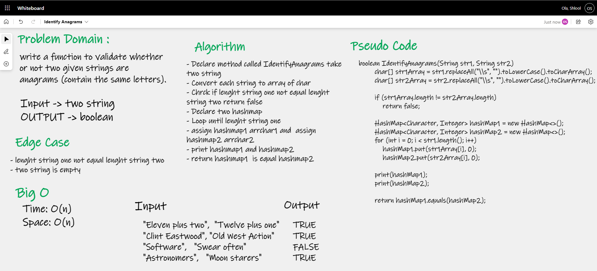

# Identify Anagrams.

## Challenge Summary

write a function to validate whether or not two given strings are anagrams (contain the same letters).

## Whiteboard Process

### Big O
- Time: O(n) 
- Space: O(n)

