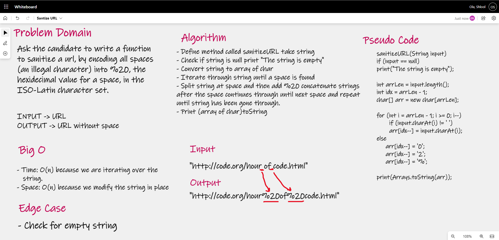

# Santize URL

## Challenge Summary

Ask the candidate to write a function to sanitize a url, by encoding all spaces (an illegal character) 
into %20, the hexidecimal value for a space, in the ISO-Latin character set.

## Whiteboard Process

### Big O
- Time: O(n) 
- Space: O(n)

