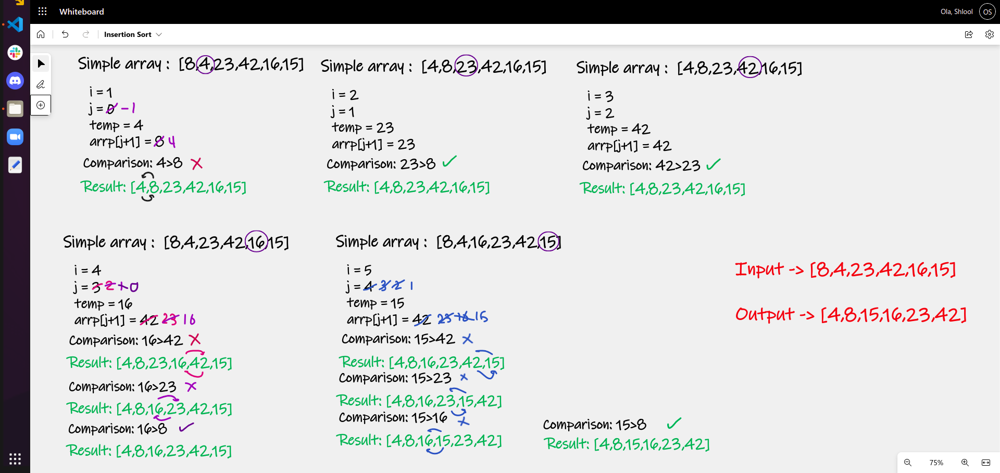

# Insertion Sort

Insertion sort is a simple sorting algorithm that builds the final sorted array (or list) one item at a time. It is much less efficient on large lists than more advanced algorithms such as quicksort, heapsort, or merge sort.

The insertion sort algorithm is not so fast because of it uses nested loop for sort the elements.

To sort the array using insertion sort below is the algorithm of insertion sort.

- Iterate from arr[1] to arr[n] over the given array.
- Compare the current element to the next element.
- If next element is less than current element, the two values are "swapped".

## Pseudocode

        InsertionSort(int[] arr)

          FOR i = 1 to arr.length

            int j <-- i - 1
            int temp <-- arr[i]

            WHILE j >= 0 AND temp < arr[j]
                arr[j + 1] <-- arr[j]
                j <-- j - 1

          arr[j + 1] <-- temp

## Trace

- Pass 01:

  In the first pass of the insertion sort we set the temp, which is 4, 
and compare it with the previous element in the array, which is 8.
  - Since 8 is greater than 4, we move the element 8 to be in the next position and insert 
  the key 4 into the previous position.

- Pass 02:

  The second pass through the array we set the temp, which is 23, 
and compare it with the previous element in the array, which is 8.
  - Since 23 is greater than 8, we do not move the element 23 and the array stays in the same order.

- Pass 03:

  The third pass through the array we set the temp, which is 42, 
and compare it with the previous element in the array, which is 23.
  - Since 42 is greater than 23, we do not move the element 42 and the array stays in the same order.

- Pass 04:

  The 4th pass through the array we set the temp, which is 16, 
and compare it with the previous element in the array, which is 42.
  - Since 16 is not greater than 42, we insert the element 16 into the previous position.
  - We then compare 16 with the previous element in the array, which is 23, since 16 is not greater than 23 we insert it into the previous position.
  - We then compare 16 with the previous element in the array, which is 8, since 16 is not greater than 8 so exit the while loop.

- Pass 05:

  On its final iteration through the array we set the temp, which is 15, 
and compare it with the previous element in the array, which is 42.
  - Since 15 is not greater than 42, we insert the element 15 into the previous position.
  - We then compare 15 with the previous element in the array, which is 23, since 15 is not greater than 23 we insert it into the previous position.
  - We then compare 15 with the previous element in the array, which is 16, since 15 is not greater than 16 we insert it into the previous position.
  - We then compare 15 with the previous element in the array, which is 8, since 15 is greater than 8 we exit the loop.

**This completes the sorting of all of the items in the sample array.**

## Efficency
- Time: O(n^2)

  - The basic operation of this algorithm is comparison. This will happen nth triangular number of times, making this n squared algorithm

- Space: O(1)
  - No additional space is being created. This array is being sorted in place, making this space at constant O(1).