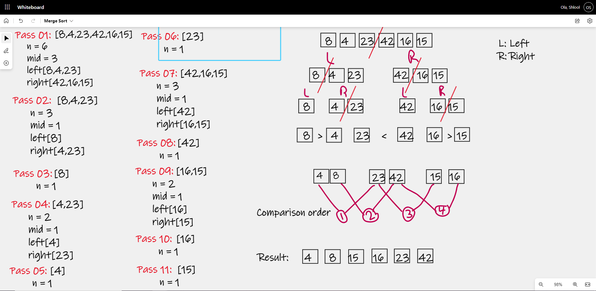

# Merge Sort

Merge Sort is a sorting algorithm that takes in an unsorted array of integers and splits it in half into two new arrays. 
It continues to do this recursively until the array has been split into many arrays holding only one integer. 
It then begins pass the pieces into a helper method that starts merging them back together putting the smaller values to the left of a return array. 
It does this until all pieces have been merged back into the return array leaving a sorted array.

## Pseudocode
        
        ALGORITHM Mergesort(arr)
            DECLARE n <-- arr.length

            if n > 1
            DECLARE mid <-- n/2
            DECLARE left <-- arr[0...mid]
            DECLARE right <-- arr[mid...n]
            // sort the left side
            Mergesort(left)
            // sort the right side
            Mergesort(right)
            // merge the sorted left and right sides together
            Merge(left, right, arr)
---
        ALGORITHM Merge(left, right, arr)
            DECLARE i <-- 0
            DECLARE j <-- 0
            DECLARE k <-- 0

            while i < left.length && j < right.length
                if left[i] <= right[j]
                    arr[k] <-- left[i]
                    i <-- i + 1
                else
                    arr[k] <-- right[j]
                    j <-- j + 1

                k <-- k + 1

            if i = left.length
               set remaining entries in arr to remaining values in right
            else
               set remaining entries in arr to remaining values in left

## Trace

- In the first step of the merge sort we first find the middle of the sample array and split it into 
2 sub-arrays: left and right: **Left Array[8, 4, 23] Right Array[42, 16, 15]**

- Since the merge sort algorithm is using recursion, we will continue to split the two sub-arrays down the middle into a left sub-array 
and a right sub-array: 
    - Left Array[8, 4, 23] is split into **left[8] and right[4, 23]**. 
    - Right Array[42, 16, 15] is split into **left[42] and right[15, 16]**.

- The third step will split the last two sub-arrays with a length that is greater than 1 into two left and right sub-arrays of length 1. 
This is the end of the recursive splitting of the arrays: 
    - right[4, 23] is split into **left[4] and right[23]**. 
    - right[15, 16] is split into **left[16] and right[15]**.

- Now that all instances of left and right arrays only contain 1 value our Merge method begins to compare and sort the number in order Merge(left,right,arr)

- Now that each instance of right and left are in order, we compare each unit to the other once again to establish proper order.

## Efficency
- Time: O(n log n)

    It is reducing the size of the array in half each time it has to work with it, thus reducing the amount of work to complete each iteration.

- Space: O(n)

    A merge sort does not sort in place and requires additional storage space for the elements.
