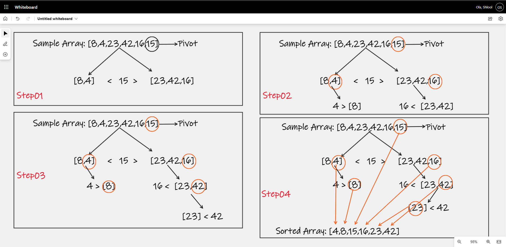

# Quick Sort

Quick Sort is a sorting algorithm that takes an unsorted List and chooses a pivot point. 
It then partitions(sorts) the list into 2 parts where the values smaller than the pivot value are moved before it 
(left partition), and the values bigger than the pivot value are moved after it (right partition). It continues this 
process for each partition until the partitions become a single element list. Then it merges all the sorted smaller 
lists into a single sorted list once again.

## Pseudocode
        
    ALGORITHM QuickSort(arr, left, right)
        if left < right
            // Partition the array by setting the position of the pivot value
            DEFINE position <-- Partition(arr, left, right)
            // Sort the left
            QuickSort(arr, left, position - 1)
            // Sort the right
            QuickSort(arr, position + 1, right)
    
    ALGORITHM Partition(arr, left, right)
        // set a pivot value as a point of reference
        DEFINE pivot <-- arr[right]
        // create a variable to track the largest index of numbers lower than the defined pivot
        DEFINE low <-- left - 1
        for i <- left to right do
            if arr[i] <= pivot
                low++
                Swap(arr, i, low)
    
         // place the value of the pivot location in the middle.
         // all numbers smaller than the pivot are on the left, larger on the right.
         Swap(arr, right, low + 1)
        // return the pivot index point
         return low + 1
    
    ALGORITHM Swap(arr, i, low)
        DEFINE temp;
        temp <-- arr[i]
        arr[i] <-- arr[low]
        arr[low] <-- temp

## Trace

1. In the first step we partition the sample array by setting a pivot. We take the array element on the right end of the array,
in this case 15, and set it as pivot. We then sort each side of the partition by swapping every any value smaller than 
the pivot 15 are on the left, and all the numbers greater than 15 are on the right.

2. Since a quick sort is recursive algorithm, the method keeps calling itself as we continue to divide each sub-array into 
smaller sub-arrays. In the second step we set 4 as the pivot of the sub-array[8, 4], since it's the array element on the 
right, partition and swap the other element 8 to its own sub-array on the right of 4 as it is greater. 
We also set 16 as the pivot of the sub-array [23, 42, 16], since it's the array element on the right, 
partition and swap the other elements 23 and 42 to their own sub-array on the right of 16 as they are greater.

3. In the third step we continue to divide the sub-arrays that have more than one element. The sub-array [8] cannot be 
divided any further since it only has one element. We set 42 as the pivot of the sub-array [23,42], 
since it's the array element on the right and partition the other element, 23, to its own sub-array on the 
left as it is smaller.

4. On the final step we are no longer able to further divide any of the sub-arrays, since [23] also only has one element 
so the recursion ends.

At this point, by swapping the elements and sorting every each sub-array, we have completed the sorting of all of the 
items in the sample array.

## Efficency

- Time: O(nlog n)
    - BigO time for quick sort is O(n*Log n) because it divide the array into halves and sorting happens as the halves are 
    brought back together.
- Space: O(n)
    - BigO space for quick sort is O(n) because no matter how many arrays you end up splitting the original array into you 
    will still have the same amount of index values as the original array.
