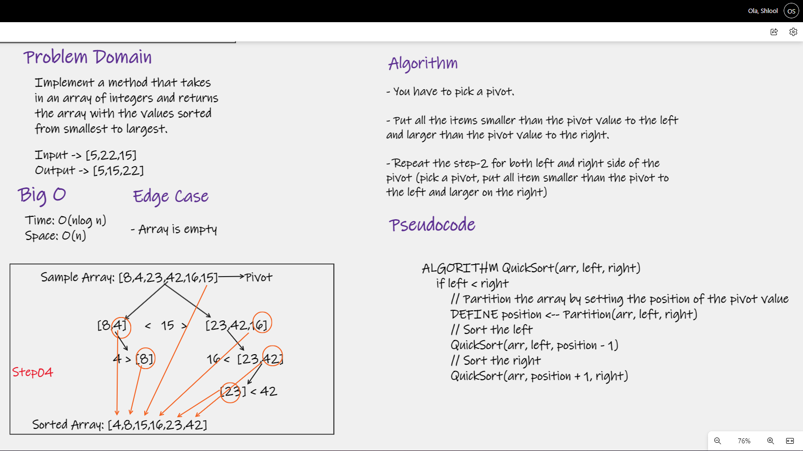

# Quick Sort

## Challenge Summary
Implement a method that takes in an array of integers and returns the array with the values sorted from smallest to largest.

## Whiteboard Process

## Approach & Efficiency
- Time: O(nlog n)
    - BigO time for quick sort is O(n*Log n) because it divide the array into halves and sorting happens as the halves are 
    brought back together.
- Space: O(n)
    - BigO space for merge sort is O(n) because no matter how many arrays you end up splitting the original array into you 
    will still have the same amount of index values as the original array.
---

### [BLOG](BLOG.md)