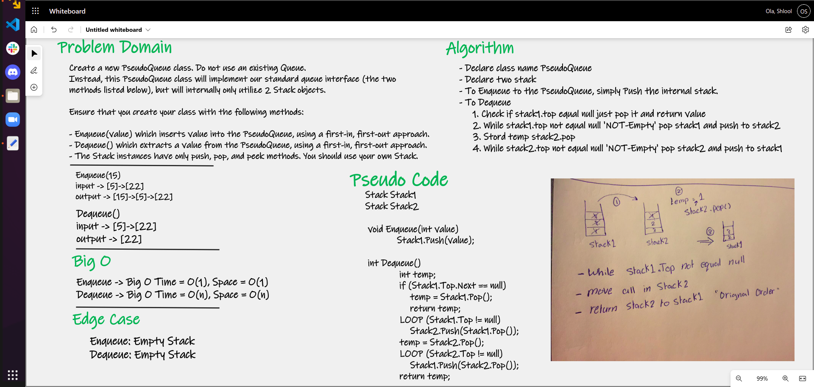

# Queue using two Stacks

# Challenge Summary

Create new PseudoQueue class, implement a standard queue interface but only utilize two stack objects.

The following methods are used to test the pseudo queue class:

Queue:
- Enqueue: which inserts value into the PseudoQueue using a first-in, first-out approach.
- Dequeue: which extracts a value from the PseudoQueue, using a first-in, first-out approach.

## Whiteboard Process

## Approach & Efficiency

- Enqueue() - Big O Time = O(1), Space = O(1): This approach uses just a simple push() 
- Dequeue() - Big O Time = O(n), Space = O(n): For Dequeue(), temporary stacks are used to move, flip, 
and reassign the stack, using while loops and pop() to transfer nodes to each stack, 
then using a temp integer to store and return the dequeued node's value.

# [Link to code](Stack-Queue-Pseudo/Classes/PseudoQueue.cs)

