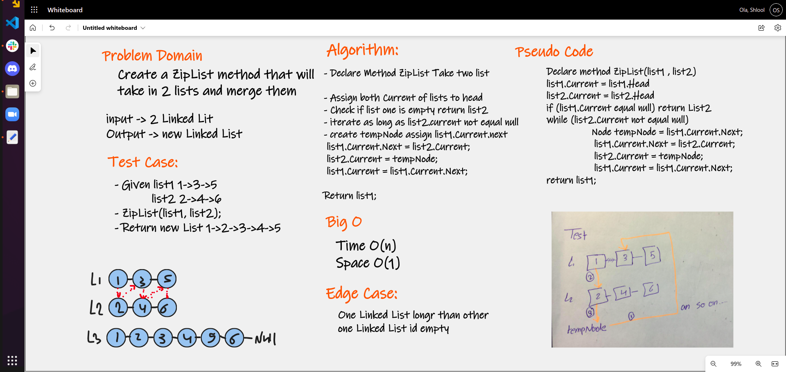

# Linked List Zip

## Description

Create a ZipList method that will take in 2 lists and merge them via alternating nodes from each list

# Challenge Summary
- Create a linked list and node class 
- Create methods to 
  - zipLists

## Whiteboard Process

## Approach & Efficiency
#### zipLists
- Big O Time = O(n) 
- Big O Space = O(1)

## API
#### zipLists
> method for the Linked List class which accepts two linked lists. 
Return a single linked list where the values have been merged, like a zipper.​